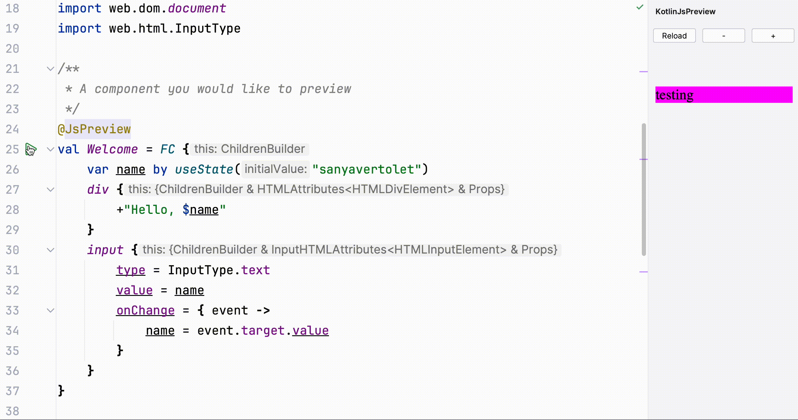
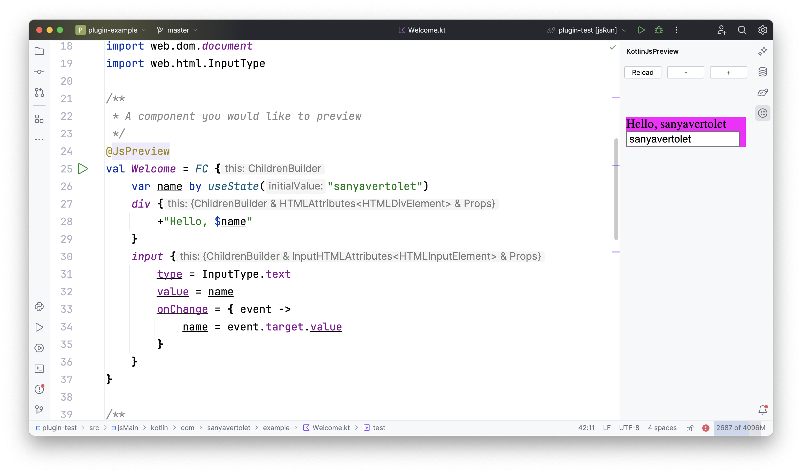
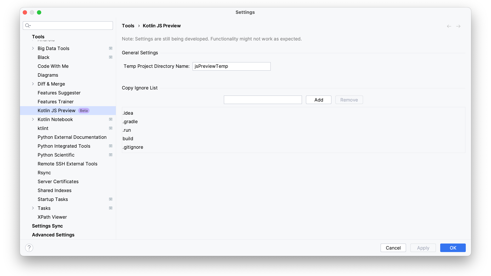

# Kotlin Js Preview
Kotlin Js Preview is a `Intellij Idea` plugin that provides a mechanism for previewing `Kotlin/JS` `React` functional components.



## Table of Contents

1. [Features](#features)
2. [Screenshots](#screenshots)
3. [Installation](#installation)
4. [Configuration](#configuration)
5. [Usage](#usage)
6. [Contributing](#contributing)
7. [Support](#support)
8. [License](#license)

## Features
 * __Live Preview__: Display a live preview of the `Kotlin/JS` `React` functional component as it's being developed.
 * __No Source Code Corruption__: Ensures that your source code remains unaltered.
 * __Settings__: Configure the plugin by navigating to `Settings -> Tools -> Kotlin JS Preview`.

### Planned
 * __Theme Toggle__: Switch between different themes or styles seamlessly to see how the component appears under various themes.
 * __Interactive Prop Edits__: Allow developers to modify props on-the-fly in the preview pane, seeing how the component reacts to different prop values.
 * __Component Tree Visualization__: Show a tree structure of the component, including its children, helping developers understand its composition.
 * __Dependency Graph__: Showcase the dependencies of the component, including state, props, and other components it relies on.
 * __Hot Reloading__

## Screenshots



## Installation
1. Download the plugin via `GitHub` or `JetBrains Marketplace`.
2. Add GitHub maven repository to your `settings.gradle.kts` file:
```kotlin
   dependencyResolutionManagement { 
       repositories { 
           mavenCentral()
           maven { 
               name = "sanyavertolet/kotlin-js-preview-idea-plugin"
               url = uri("https://maven.pkg.github.com/sanyavertolet/kotlin-js-preview-idea-plugin")
               credentials { 
                   username = providers.gradleProperty("gpr.user").orNull ?: System.getenv("GITHUB_ACTOR")
                   password = providers.gradleProperty("gpr.key").orNull ?: System.getenv("GITHUB_TOKEN") 
               } 
           } 
       }
   }
```
For more information, read [GitHub Docs](https://docs.github.com/en/packages/working-with-a-github-packages-registry/working-with-the-gradle-registry).

3. Add `com.sanyavertolet.kotlinjspreview:core:{PLUGIN_VERSION}` to JS SourceSet dependencies in your `build.gradle.kts` file:
```kotlin
   kotlin {
    sourceSets {
        val jsMain by getting {
            dependencies {
                // other dependencies
                implementation("com.sanyavertolet.kotlinjspreview:core:${PLUGIN-VERSION}")
            }
        }
    }
}
```

4. Create a wrapper for your JS entrypoint:
```kotlin
@RootWrapper
fun wrapper(fc: FC<*>) {
    val mainDiv = document.getElementById("wrapper")!!
    createRoot(mainDiv).render(
        fc.create(),
    )
}

// Here is how you should use the wrapper 
fun main() = wrapper(default)
```
Make sure it is marked with `@com.sanyavertolet.kotlinjspreview.RootWrapper` annotation.
The first argument of your wrapper __must__ be an `FC` to render.

5. Mark the `FC` you want to preview with `@com.sanyavertolet.kotlinjspreview.JsPreview` annotation:
```kotlin
@JsPreview
val Welcome = FC {
    var name by useState("sanyavertolet")
    div {
        +"Hello, $name"
    }
    input {
        type = InputType.text
        value = name
        onChange = { event ->
            name = event.target.value
        }
    }
}
```

6. Click on `Run` icon that appears near the `val Welcome = FC {` string. Your project will be copied, modified and built.

## Usage
For more information see [example project](https://github.com/sanyavertolet/kotlin-js-preview-idea-plugin-example).

## Configuration
Plugin configuration is available. To configure it, go to `Settings -> Tools -> Kotlin JS Preview`.

## Contributing
All the contributions are welcomed! Please see [CONTRIBUTING.md](CONTRIBUTING.md) file for details on how to get started.

## Support
For support or to report bugs, please open an issue on [kotlin-js-preview-idea-plugin issues](https://github.com/sanyavertolet/kotlin-js-preview-idea-plugin/issues) page.

## License
`Kotlin Js Preview` is licensed under the `MIT Licence`. See the [LICENSE](LICENSE) file for details.
